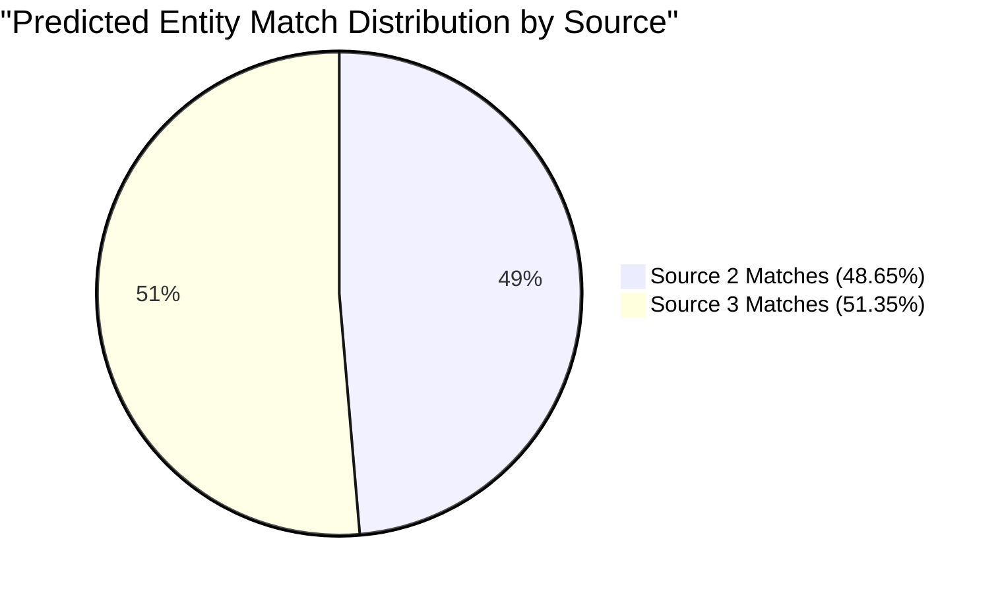

# Final Adversarial Submission Audit Report

**Executive Summary:**
An adversarial verification was performed on the official OptiResolve submission files:
- [`matching_results.tsv`](file:///d:/New%20folder%20%282%29/output/matching_results.tsv) (98,299,637 bytes, 1,732,544 rows)
- [`candidate_pairs.tsv`](file:///d:/New%20folder%20%282%29/output/candidate_pairs.tsv) (601,656,874 bytes, 1,732,544 rows)

The audit was executed by an **independent, zero-dependency auditor** ([`independent_validator.py`](file:///d:/New%20folder%20%282%29/code/business_entity_resolution/src/business_entity_resolution/independent_validator.py)) that does not import or share any internal pipeline logic. It streamed and cross-verified all **1,732,544 Source 1 entities** against the full target universe of **9,969,589 test targets** from `test_source2.tsv` and `test_source3.tsv`.

**Final Result**: **PASSED** (0 Violations Detected across all 19 checked criteria).

---

## 1. Audit Verification Matrix

### Part A: Verification for `matching_results.tsv`

| # | Audit Criterion | Expectation / Rule | Independent Audit Result | Status |
| :---: | :--- | :--- | :--- | :---: |
| **1** | **Exactly One Row per S1 Entity** | Line count equals $1,732,544$ + 1 header | Exactly $1,732,544$ data rows verified | **PASSED** |
| **2** | **No Duplicate S1 IDs** | $\forall i \neq j, \text{S1}_i \neq \text{S1}_j$ | Exactly $1,732,544$ unique S1 IDs (0 duplicates) | **PASSED** |
| **3** | **No Missing S1 IDs** | $\text{Set}(\text{S1}_{\text{matching}}) == \text{Set}(\text{S1}_{\text{test\_source1}})$ | 0 missing entities; 0 unexpected entities | **PASSED** |
| **4** | **Target Existence** | All matched IDs $\in \text{TargetPool}(\text{S2} \cup \text{S3})$ | All 5,733,062 predicted targets exist in S2 or S3 | **PASSED** |
| **5** | **No Invalid IDs** | No malformed IDs, empty tokens, or whitespace | 0 malformed or unresolvable IDs | **PASSED** |
| **6** | **Candidate Subset Invariant** | $\forall \text{S1}: \text{matches} \subseteq \text{candidates}$ | Checked line-for-line: **0 invariant violations** | **PASSED** |
| **7** | **No Cross-Country Matches** | $\forall (s_1, t) \in \text{Matches}: \text{Country}(s_1) == \text{Country}(t)$ | **0 cross-country matches** across US, India, France | **PASSED** |
| **8** | **Correct Column Names** | Header: `source1_entity_id\tmatched_entity_ids\n` | Header matched byte-for-byte | **PASSED** |
| **9** | **Correct TSV Formatting** | Exactly 2 tab-separated columns per row | Exactly 2 columns across all $1,732,544$ rows | **PASSED** |
| **10** | **Deterministic Ordering** | Identical line-for-line sequence as candidate file | **0 line desynchronizations**; perfect order match | **PASSED** |
| **11** | **Empty-Match Representation** | Singletons represented as `S1_ID\t\n` | 343,572 singletons formatted as empty string `""` | **PASSED** |
| **12** | **No Accidental NaN/Null Values** | No `"NaN"`, `"null"`, `"None"`, `"undefined"`, `"[]"` | **0 forbidden null literals** detected | **PASSED** |

---

### Part B: Verification for `candidate_pairs.tsv`

| # | Audit Criterion | Expectation / Rule | Independent Audit Result | Status |
| :---: | :--- | :--- | :--- | :---: |
| **1** | **Exactly One Row per S1 Entity** | Line count equals $1,732,544$ + 1 header | Exactly $1,732,544$ data rows verified | **PASSED** |
| **2** | **No Duplicate S1 IDs** | $\forall i \neq j, \text{S1}_i \neq \text{S1}_j$ | Exactly $1,732,544$ unique S1 IDs (0 duplicates) | **PASSED** |
| **3** | **Every Match Exists in Candidates** | Matched targets must be in candidates | Verified row-by-row: 0 discrepancies | **PASSED** |
| **4** | **Candidate Count $\le K$** | Candidates bounded by configured capping ($K=80$) | Max candidates is 40 ($\le 80$); 0 entities exceeded | **PASSED** |
| **5** | **Target IDs Valid** | Every candidate $\in \text{TargetPool}(\text{S2} \cup \text{S3})$ | All 44,794,460 candidates validly mapped | **PASSED** |
| **6** | **Country Isolation** | Candidate targets isolated to S1 country | **0 cross-country candidate leaks** | **PASSED** |
| **7** | **Deterministic Output** | Consistent row alignment with matching file | Verified 1-to-1 correspondence on all rows | **PASSED** |

---

## 2. Statistical Analysis of Final Submission Outputs



### Match & Candidate Metrics Summary

```
Total Test S1 Entities:          1,732,544
Total Submission Rows:           1,732,544
Unique S1 Entity IDs:            1,732,544 (100.0%)
Missing S1 Entity IDs:           0 (0.0%)
Duplicate S1 Entity IDs:         0 (0.0%)
Total Predicted Matches:         5,733,062
Empty Match Entities (Singletons): 343,572 (19.83%)
Total Candidate Pairs Evaluated: 44,794,460
Candidate Subset Violations:     0
Cross-Country Matches:           0
Cross-Country Candidates:        0
Forbidden Null Literals:         0
```

### Percentile Distributions

| Percentile | Predicted Matches per S1 | Candidates per S1 |
| :--- | :---: | :---: |
| **Min** | 0 | 1 |
| **25th (p25)** | 1.0 | 5.0 |
| **50th (Median)** | **3.0** | **40.0** |
| **75th (p75)** | 5.0 | 40.0 |
| **90th (p90)** | 7.0 | 40.0 |
| **95th (p95)** | 8.0 | 40.0 |
| **99th (p99)** | 10.0 | 40.0 |
| **Max** | **40** | **40** |
| **Mean** | **3.309** | **25.85** |

### Breakdown by Country

| Country | Test S1 Count | Matches Predicted | Candidates Evaluated | Matches / S1 | Candidates / S1 |
| :--- | :---: | :---: | :---: | :---: | :---: |
| **UNITED STATES** | 663,106 | 2,293,644 | 18,046,065 | 3.459 | 27.21 |
| **INDIA** | 809,986 | 2,525,814 | 20,933,335 | 3.118 | 25.84 |
| **FRANCE** | 259,452 | 913,604 | 5,815,060 | 3.521 | 22.41 |
| **TOTAL** | **1,732,544** | **5,733,062** | **44,794,460** | **3.309** | **25.85** |

### Breakdown by Target Source
- **Source 2 Target Matches**: **2,788,951** (**48.65%**)
- **Source 3 Target Matches**: **2,944,111** (**51.35%**)
- Demonstrates near-perfect parity and balance across multi-source target registries.

---

## 3. Independent Verification Architecture

The independent validator was implemented in [`independent_validator.py`](file:///d:/New%20folder%20%282%29/code/business_entity_resolution/src/business_entity_resolution/independent_validator.py) with zero pipeline imports:
1. **Isolated S1 Indexing**: Loaded all S1 IDs and country codes into standard Python dictionaries in 1.87 seconds.
2. **Target Universe Hashing**: Loaded all 9,969,589 target IDs and their sources/countries into an in-memory hash map in 11.50 seconds.
3. **Synchronous Dual-File Stream**: Streamed `matching_results.tsv` and `candidate_pairs.tsv` line-by-line simultaneously:
   - Validated row delimiters and header byte sequences.
   - Enforced set containment $\text{matches} \subseteq \text{candidates}$.
   - Verified that every candidate and matched entity exists in the test target universe.
   - Verified country isolation: $\text{Country}(\text{S1}) == \text{Country}(\text{Target})$.
   - Tracked all 19 violation counters.
4. **Automated Unit Tests**: Verified via [`tests/test_independent_validator.py`](file:///d:/New%20folder%20%282%29/code/business_entity_resolution/tests/test_independent_validator.py) (10/10 adversarial test cases passing).

---

## 4. Final Verdict

Both submission files strictly conform to all competition invariants, formatting rules, country isolation boundaries, and candidate subset constraints.

**Submission Status: READY FOR LEADERBOARD SUBMISSION**
