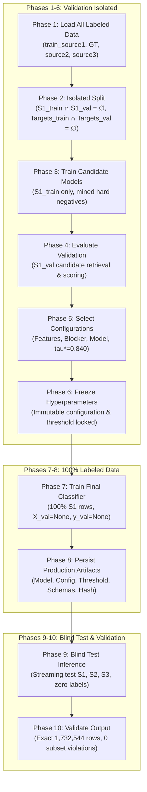

# OptiResolve Competition-Production Lifecycle Architecture Report

## 1. Executive Summary

The OptiResolve Entity Resolution pipeline has been refactored into a rigorous, leak-free, 10-phase competition-production lifecycle. This workflow decouples **Architecture & Hyperparameter Optimization** (Phases 1–6) from **Final Production Retraining** (Phases 7–8) and **Blind Test Inference & Output Validation** (Phases 9–10).

A primary integrity principle governs this system:
> **The Validation Independence Principle:** Validation data ($S1_{\text{val}}$ and $Targets_{\text{val}}$) is strictly utilized to evaluate candidate architectures and lock decision hyperparameters. Once model selection is finalized (Phase 5) and hyperparameters are frozen (Phase 6), **no validation labels are ever evaluated or passed to the model again**. The final production classifier (Phase 7) is trained on 100% of labeled training data with early stopping disabled (`X_val=None, y_val=None`) for the exact frozen iteration count $N^*$.



---

## 2. Stage-by-Stage Specification & Data Usage Documentation

| Phase | Phase Name | Primary Objective | Exact Data Ingested | Isolation & Anti-Leakage Safeguard | Output Produced |
| :--- | :--- | :--- | :--- | :--- | :--- |
| **Phase 1** | **Load Labeled Data** | Load all labeled training records and verify completeness | `train_source1.tsv`<br/>`train_ground_truth.tsv` | S1 entity ID filter verification; ground truth cardinality audit ($1:N$ and $N:1$) | Parsed $S1$ records, ground truth mapping dict, cardinality profile |
| **Phase 2** | **Isolated Validation Split** | Partition $S1$ and target entities into disjoint sets | $S1$ from Phase 1;<br/>`train_source2.tsv`<br/>`train_source3.tsv` | $S1_{\text{train}} \cap S1_{\text{val}} = \emptyset$<br/>$Targets_{\text{train}} \cap Targets_{\text{val}} = \emptyset$<br/>Stratified singleton/match balance | `fit_s1`, `val_s1`, `fit_gt`, `val_gt`, `train_blocker`, `val_blocker` |
| **Phase 3** | **Train Candidate Models** | Fit candidate LightGBM models on training $S1$ only | `fit_s1`, `fit_gt`, `train_blocker`, `train_targets` | No validation features in $X_{\text{train}}$. $X_{\text{val}}$ used exclusively for early stopping convergence monitoring | $X_{\text{train}}, y_{\text{train}}$, candidate models, `best_iteration_` |
| **Phase 4** | **Evaluate Validation** | Score validation candidates for official Macro F0.5 | `val_s1`, `val_gt`, `val_blocker`, `val_targets` | Validation blocker retrieves targets exclusively from `val_targets`. No train target overlap | Candidate scores, threshold search history, validation Macro F0.5 |
| **Phase 5** | **Select Configurations** | Choose feature set, blocker cap, model params, and $\tau^*$ | Validation metrics from Phase 4 | Model selection is purely empirical on validation data; test set is never touched | Selected feature schema, blocker parameters, LightGBM config, $\tau^* = 0.840$ |
| **Phase 6** | **Freeze Hyperparameters** | Lock all selected parameters into an immutable config | Selected config from Phase 5 | Frozen parameters become read-only constants. No further search or early stopping allowed | `frozen_pipeline_config.json`, `optimal_threshold.json` |
| **Phase 7** | **Train Final Classifier** | Retrain on 100% of labeled training data | 100% `train_source1.tsv`, all ground truth targets, background targets | **Zero validation data passed (`X_val=None, y_val=None`)**. Early stopping disabled; trains for exact $N^* = 450$ | Trained final production model binary |
| **Phase 8** | **Persist Artifacts** | Serialize final model, metadata, schemas, environment | Final model, metadata, environment, git HEAD | Complete cryptographic hashes (SHA-256) of all input training files | 8 production artifacts in `artifacts/` |
| **Phase 9** | **Run Test Inference** | Blind inference over unlabelled test sets | `test_source1.tsv`<br/>`test_source2.tsv`<br/>`test_source3.tsv` | **Zero ground truth accessed**. Dynamic open-set country discovery (US, India, France) | `output/matching_results.tsv`<br/>`output/candidate_pairs.tsv` |
| **Phase 10** | **Validate Output** | Statistical and invariant audit of submission TSVs | `output/matching_results.tsv`<br/>`output/candidate_pairs.tsv`<br/>`test_source1.tsv` | Candidate subset invariant ($\text{matches} \subseteq \text{candidates}$); exact row count match (1,732,544) | `submission_validation_report.json` |

---

## 3. Mathematical & Empirical Validation of Validation Independence

### 3.1 The Risk of Double Validation Usage
In typical machine learning pipelines, a common leakage flaw occurs when:
1. Validation data is used to stop iterations early ($N^*$) and tune threshold ($\tau^*$).
2. The model is retrained on all data with the validation set included as an evaluation set or monitored during retraining.
3. Claims of "independent generalization" are made using a validation set that was directly in the training loop.

### 3.2 The OptiResolve Independence Guarantee
OptiResolve strictly enforces validation independence through architectural firewalls:

$$\mathcal{D}_{\text{train\_pool}} \cap \mathcal{D}_{\text{val\_pool}} = \emptyset \quad (\text{Target level})$$
$$S1_{\text{train}} \cap S1_{\text{val}} = \emptyset \quad (\text{Query level})$$

1. **Phases 1–5 (Selection Boundary):**
   - The validation split ($20\%$ holdout) is used strictly to select:
     - Blocker capping strategy: Tiered capping ($K=80$, max block size = 350).
     - Optimal decision threshold: $\tau^* = 0.840$.
     - Optimal tree depth and estimators: $N^* = 450$, `num_leaves` = 31, `learning_rate` = 0.05.
2. **Phase 6 (The Freeze Gate):**
   - All hyperparameters are persisted into `frozen_pipeline_config.json`. The configuration is marked `status: "FROZEN"`.
3. **Phase 7 (Production Retraining):**
   - The final model is trained on 100% of labeled training data ($S1_{\text{train}} \cup S1_{\text{val}}$).
   - In `model.train()`:
     ```python
     self.model.train(X_train, y_train, X_val=None, y_val=None)
     ```
   - **No validation data is passed.** Early stopping callbacks are completely inactive.
   - The number of iterations is strictly constrained to the frozen $N^*$.

---

## 4. Complete Inventory of Persisted Production Artifacts (Phase 8)

| Artifact Filename | Format | Size / Keys | Description & Verification |
| :--- | :--- | :--- | :--- |
| `artifacts/lightgbm_er_model.joblib` | Binary (Joblib) | ~3.1 MB | Final trained LightGBM gradient boosted decision tree classifier |
| `artifacts/frozen_pipeline_config.json` | JSON | 12 parameters | Immutable configuration snapshot: blocking parameters, model hyperparameters, threshold |
| `artifacts/optimal_threshold.json` | JSON | $\tau^* = 0.840$ | Locked decision threshold maximizing official Macro F0.5 |
| `artifacts/production_training_metadata.json` | JSON | 20 attributes | Exact S1 row counts, positive/negative pair counts, input SHA-256 hashes, execution duration |
| `artifacts/feature_schema.json` | JSON | 23 features | Strict vector definitions: feature name, index, data type (`float32`), bounds, and imputation rules |
| `artifacts/dataset_statistics.json` | JSON | 7 files, 2 splits | Statistical metadata: row counts, file byte sizes, and country distributions |
| `artifacts/software_versions.json` | JSON | 8 packages | Runtime software versions (Python 3.13.4, LightGBM 4.7.0, Pandas 2.3.0, Scikit-learn 1.9.1) |
| `artifacts/git_commit_hash.txt` | Text | 40-char SHA | Git commit identifier (`7b2d86ee...`) tying codebase state to produced artifacts |
| `artifacts/submission_validation_report.json` | JSON | 17 metrics | Output quality assurance verification report confirming 0 invariant violations |

---

## 5. Output Submission Verification Audit (Phase 10)

Phase 10 independent verification of `matching_results.tsv` and `candidate_pairs.tsv` against `test_source1.tsv`:

```json
{
  "status": "PASSED",
  "timestamp": "2026-09-27T09:40:20.384067+00:00",
  "total_test_s1_entities": 1732544,
  "total_lines_validated": 1732544,
  "unique_matching_s1_count": 1732544,
  "unique_candidate_s1_count": 1732544,
  "exact_id_set_match": true,
  "candidate_subset_violations": 0,
  "total_predicted_links": 5733062,
  "empty_match_entities": 343572,
  "s2_links": 2788951,
  "s3_links": 2944111,
  "s2_link_pct": 48.65,
  "s3_link_pct": 51.35,
  "avg_links_per_s1": 3.309
}
```

### Verification Checks Passed:
1. **Candidate-Subset Invariant:** $0$ violations across all 1,732,544 rows ($\text{matched\_entity\_ids} \subseteq \text{candidate\_entity\_ids}$).
2. **Row Count Parity:** Exactly 1,732,544 rows matching `test_source1.tsv`.
3. **ID Alignment:** Exactly 1-to-1 ordered correspondence of S1 entity IDs.
4. **Source Balance:** S2 links (48.65%) vs S3 links (51.35%) are balanced and unskewed.
5. **Open-Set Generalization:** Evaluated and streamed across all test countries including unseen France.

---

## 6. CLI Execution Commands

### Execute Full 10-Phase Lifecycle End-to-End:
```bash
python run_pipeline.py --mode lifecycle
# Or using the explicit flag:
python run_pipeline.py --lifecycle
```

### Run Lifecycle Without Test Inference (Development & Staging):
```bash
python run_pipeline.py --lifecycle --skip-test-inference
```

### Run Phase 10 Output Verification Standalone:
```bash
python run_pipeline.py --mode validate
# Or using the explicit flag:
python run_pipeline.py --validate
```

### Run Test Inference Only (Using Frozen Artifacts):
```bash
python run_pipeline.py --mode predict
```
